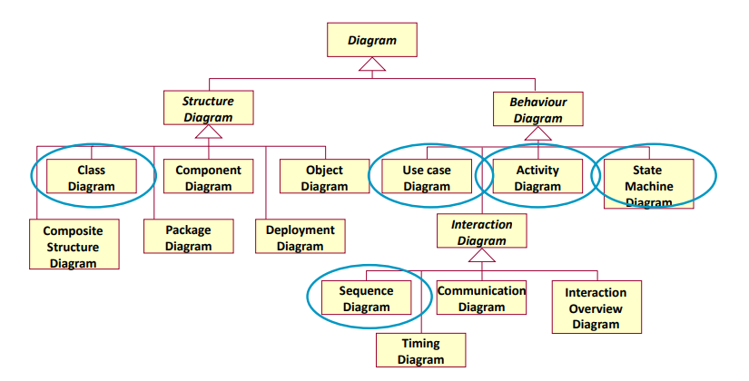

# System Design

## What is a system ?

@startuml
left to right direction

package "System" {
  [System Functionality]
  [Control Mechanism] -left-> [System Functionality] : Control
}

[Input] --> [System Functionality]
[System Functionality] --> [Output]
[Input] --> [Control Mechanism] : Feed-Forward
[Output] --> [Control Mechanism] : Feedback

@enduml

*adapted from Bennett et al.*

## Model

A model is a **simplified representation** of the world (or part of a software system) from a specific **view**.

+ Simplified: Not the entire system
+ Representation: Notation used.
+ View: aspect modelled.

## UML (Unified Modelling Language)

+ In UML mostly **diagrams** are used as a representation to define models.
+ UML diagrams are **unambiguous**. in contrast to natural language.

### UML Diagrams Taught
+ Data
    + Class Diagram
+ Functionality
    + Use Case Diagram
+ Behavior
    + Activity Diagram
    + State Machine Diagram
+ Interaction
    + Sequence Diagram

### Definitions

| Term | Definition|
| ---- | --------- |
| Design | Modelling how the various parts of a system will work together |
| Analysis | Finding out what the system should do and how the different system parts are related to one another |

## Approaches to Software Development
+ Waterfall
+ Scrum
+ Kanban
+ Extreme Programming