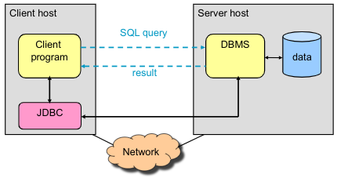

# Database Connectivity

## JDBC

::: theorem JDBC
Acronym doesn't have a meaning.
It's the standard mechanism for accessing relational database management systems from different manufacturers.
:::



Steps to use a database in a Java program using JDBC:
1. Load the JDBC driver
2. Define the connection URL
3. Establish the connection
    + Create a statement object
    + Execute the query.
    + Process the results.
4. Close the connection

### Loading the JDBC driver

`Class.forName("driver_class_name")`
+ Loads driver class
+ JDBC driver has a static initializer that registers itself with the JDBC driver manager.

Example:
```java
try {
    Class.forName("org.postgresql.Driver") ;
} catch (ClassNotFoundException cnfe) {
    System.err.println("Error loading driver: "+ cnfe);
}
```

### Defining the connection URL
+ The connection URL specifies the network address to reach the database server.
+ URL format for postgres `jdbc:postgresql://[hostname][:port]/[dbname]`

Example:
```java
String host = "bronto.ewi.utwente.nl";String dbName = "dbNNN";
String url = "jdbc:postgresql://" + host + ":5432/" + dbName;
```

::: tip change default schema
Add `?currentSchema=movies` to the url
to change the default schema to movies.
:::

### Establishing the connection
static method `getConnection()` of the class `DriverManger`.
+ Establishes connection with the database server.
+ Throws `SQLException` if something goes wrong.
+ The connection is represented by a `Connection` object.

Example:
```java
try {
    Connection connection = DriverManager.getConnection(url, username, password);
} catch(SQLException sqle) {
        System.err.println("Error connecting: " + sqle);
}
```

### Creating a statement:

A `Statement` object should be created to send
SQL statements to the database server.

A `Statement` is created by the method `createStatement()` of class `Connection`

Example:

```java
Statement statement = connection.createStatement();
```

### Executing a statement

1. create a statement as a `String` according to the SQL syntax.
2. call `executeUpdate()` or `executeQuery()`
    + `executeUpdate()`
        + used for `UPDATE, INSERT, DELETE`
        + returns the count of affected rows.
    + `executeQuery()`
        + used for `SELECT`
        + returns a `ResultSet` object representing the query result.
        + the query result represents a data table.

Example:

```java
String query = "SELECT col1, col2, col3 " +
    "FROM sometable " +
    "WHERE col1 = value1;";
ResultSet resultSet = statement.executeQuery(query);
```

### Prepared Statements

Used to pass arguments to a query.
The `?` can be used in the query string
to mark where the argument will be placed.

Example:
```java
String query = "SELECT m.name " +
    "FROM movie m, acts a " +
    "WHERE m.mid = a.mid " +
    " AND a.pid = p.pid " +
    " AND p.name = ?;";

PreparedStatement st = connection.prepareStatement(query);
st.setString(1, "Bruce Willis");
ResultSet resultSet = st.executeQuery();
```

### Processing Results

A `ResultSet` object maintains a cursor that points to the current row in the data table.

+ The method `next()` of the `ResultSet` class
    + moves the cursor to the next row.
    + Returns `true` if the cursor is valid.

+ Methods `getX(int colIndex)/getX(String colName)`
    + returns the value of the designated column in the current row as type `X`
    + First column in a row has index 1.

Example:

```java
while (resultSet.next()) {
    System.out.println(resultSet.getString(1) + " " + resultSet.getFloat(2) + " " + resultSet.getDate(3));
}
```

`ResultSetMetaData` object represents metadata
about the `ResultSet` object, which can be retrieved with the methods:
+ getColumnCount(): gives the number of columns
+ getColumnName(): gives the name of a column
+ getColumnType(): gives an int value that represents the column type

+ It does not allow one to ask for the number of rows.
+ method `getMetaData()` of `ResultSet` object.

### Closing the connection

`connection.close()`

## Stored Procedures
You can store SQL statements as procedures
with the data in the database.

Advantages:
+ Intermediate data does not need to be communicated to the application.
+ Procedure's SQL statements prepared in advance.
+ Authorization can be done at procedure level.
+ Added security since procedure resides in the database server.
+ applications that call the procedure need not know the details of the database schema - all database access is encapsulated within the procedure.

Example:
```sql
CREATE OR REPLACE FUNCTION MoviesOfActor(actor text)
    RETURNS TABLE(name text) AS $$
BEGIN
    RETURN QUERY
        SELECT m.name
        FROM movie m, acts a
        WHERE m.mid = a.mid
            AND a.pid = p.pid
            AND p.name = actor;
END;
$$ LANGUAGE plpgsql;
```

+ plpgsql: language that adds loops and other control structures to SQL.

Executing a stored procedure:

```sql
SELECT MoviesOfActor("Bruce Willis");
```
## CLI - SLI

+ JDBC is a form of "Call Level Interface" (CLI)
    + Program is entirely written in host language
    + SQL statements are values of String variables.
+ Contrast: Statement Level Interface (SLI)
    + Program is a mixture of host language statements and SQL statements and directives.
    + e.g. SQLJ, SQL\/PSM

## ORM

::: theorem ORM
**O**bject **R**elational **M**apping
is a mechanism that allows you to access objects
without having to consider how the objects relate to their data source (database).

The "ideal" is "you don't need to bother with the database just declare your classes as persistent and access the data with pure Java"

Example: JPA (Hibernate)
:::

ORMs take build on top on databases 
to offer an OOP way of accessing data.
+ Objects are stored in tables.
+ Objects are "Hydrated" in the application.
+ *Hydration* is filling an already instantiated object with data from the database.

+ ORMs use annotations to allow you
to store java objects.
+ ORMs map entity classes to database tables.
+ ORMs map object attributes to table columns.

ORM benefits :smile: :
+ Generates underlying database for developer.
+ Fast development
+ Fairly scalable and efficient
+ Wide variety of vendors
+ Support variety of underlying databases including NoSQL solutions.

ORM drawbacks :worried: :
+ Not transparent with what happens.
+ Not very predictable.
+ Hard to deal with performance problems.