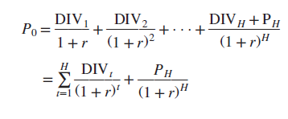

# 4-2 How common stocks are valued

There are many variables which affect the company's stock price. 
One of them is the book value which stands the company's assets such as plant, machineries, inventories of materials, cash in the bank and so on.
However, book values do not give the full overview. For example they do not incorporate inflation as well as intangible assets (such as trademarks, patents).

Book values are extremely useful when it comes to liquidation value (Since in in the book values it is written how much are worth "hard" assets of the company). Liquidation value is what investors get when a failed company is shut down and its assets are sold off.

There is also an another term which is important to know such as going-concern value. Going-concern value is created when a collection of assets is organized into a healthy opareting business. Going concern value is also known as total value.

## Valuation by comparables

When financial analysts need to value a business, they often start by identifying a sample of similar firms as potential comparables. They then examine how much investors in the comparable companies are prepared to pay per dollar of earnings or book assets. This approach is often called "valuation by comparables"

## Stock Price and dividends

Not all companies pay dividends. Rapidly growing companies typically reinvest earnings instead of paying out cash.

## Calculatig the expected return from the share

Here is the formula -> "The photo should be here"
Where variables stand as follows:
Div1 = expected dividend per share
P1= expected price at the year 1
P0= the current price of the share (year 0)

On the other hand, if you are given investors’ forecasts of dividend and price and the expected return offered by other equally risky stocks, you can predict today’s price: 

Example:
Div1 = 5$
P1 = 110$
r = 0.15

What excatly r stands here for?
It’s called the market capitalization rate or cost of equity capital which are just alternative names for the opportunity cost of capital.

Of cource it is possible to calculate the present value of the share by given the expected dividends and share price by the end of the second/third/thourth.... year. 
The  general stock price formula stands as follows: 

  