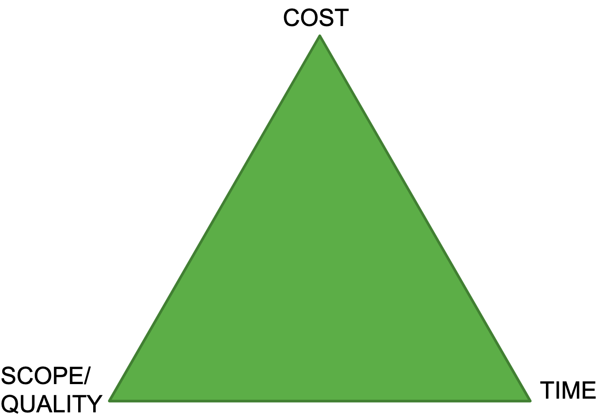
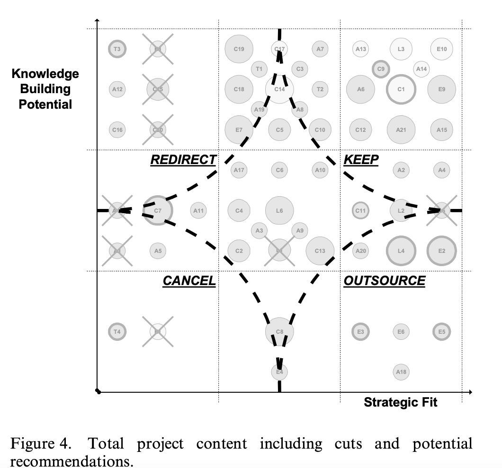
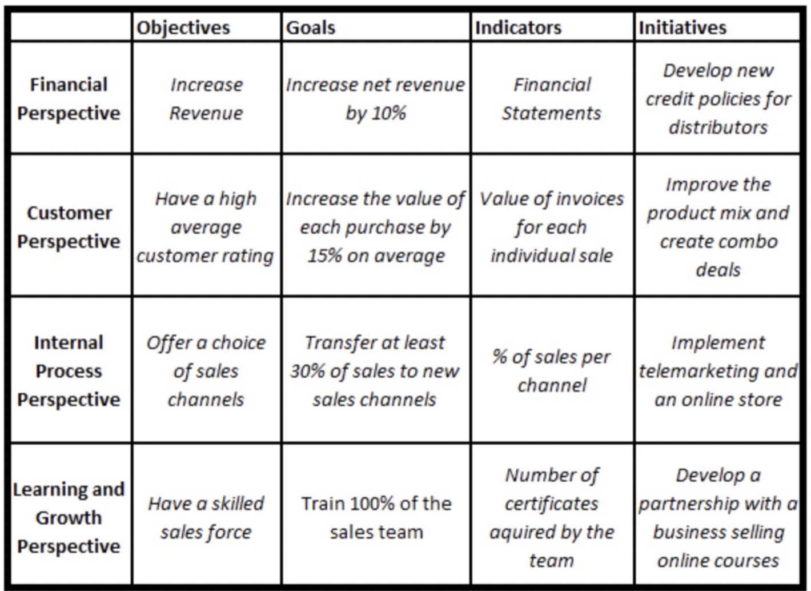
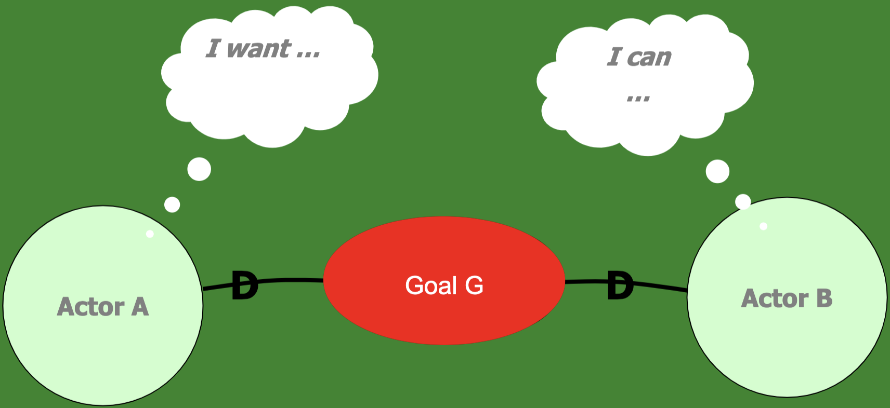
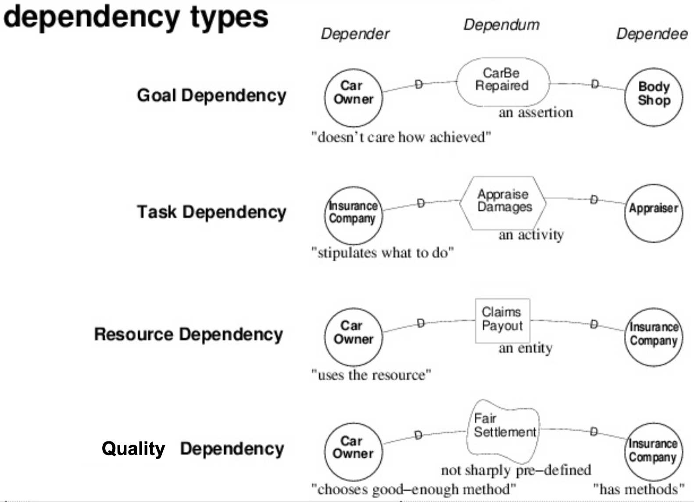
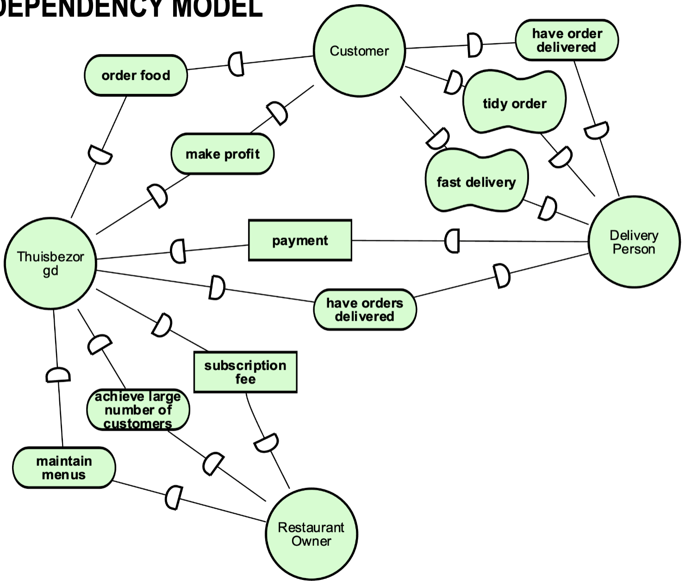
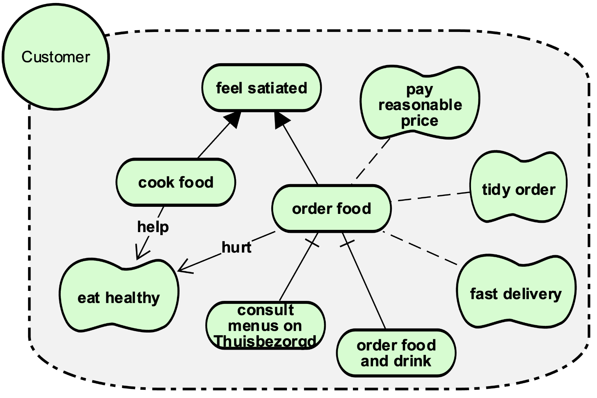
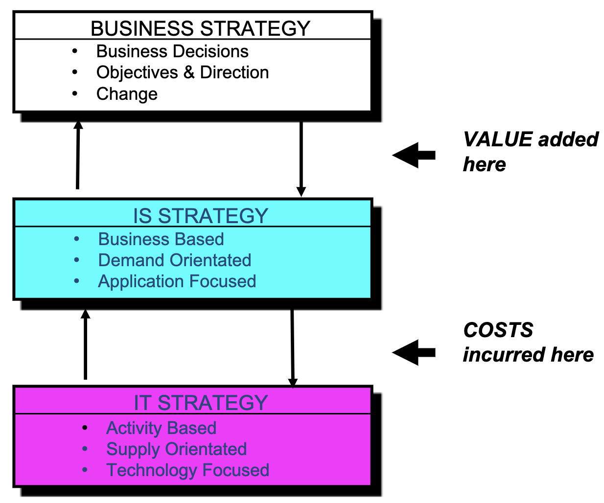
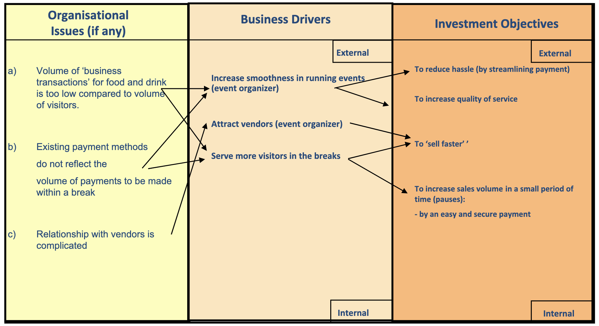
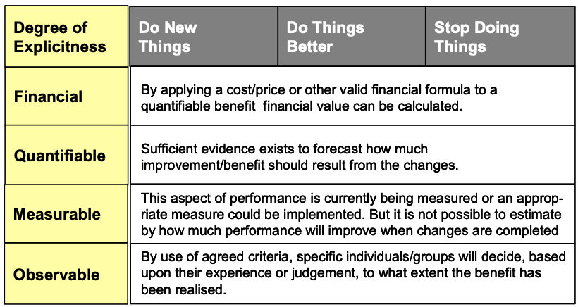

# Exam 1: **Project Design & Initiation**

*A summary of all lectures and related readings for every lecture.*

## Lecture 1

- Determinants for **software success:**
    - **Strategy & stakeholders:** clear objectives, business cases, scope, executive support
    - **Technology & content:** get experts where needed, use standardized & proven software, user involvement, handling conflicts & legal issues
    - **Building teams & capabilities:** qualified, experienced, motivated team, sustainable balance internal/external resources
    - **Project progress:** reliable estimates + plans, appropriate status transparency, proven methodologies, project dynamics & progress decisions

- **Project** balance triangle:
    

    

- **Black swan:** unpredictable high-impact event that can lead to a company’s downfall

## Lecture 2

- People see / prioritize different problems (**Jung’s cognitive styles**);
    - **Sensing:** gathering concrete information
    - **Intuiting:** surfacing information in a creative & holistic way → different interpretations
    - **Thinking:** logical + impersonal connections
    - **Feeling:** judgement in merits & values

- Type of **problem solving processes**:
    1. *Structured* → problem can be solved through **searching** for a solution
    2. *Structurable* → a strategy can be found by structuring methods:
        - **modeling** → scenarios, process models
        - **reformulation** → analogies, metaphors, scoping, constraints
        - **decomposition** → WBS and problem taxonomies
    3. *Unstructured* → a reliable solution strategy cannot be found at a given moment, needs heuristics & research
    4. *Wicked* → highly political & multidisciplinary problems, solution finding by dialetics

- **Organization** types:
    - **Mechanistic (bureaucratic)**: formal, centralized, specialized, minimal communication → good fit for **simple** + **stable** environments
    - **Organic (simple)**: informal, decentralized, few authority levels, breadth view, extensive levels of communication → good fit for **uncertain** + **complex** environments

- **Shenhar’s** scope & technical uncertainty table:
    
    
    
    - **Technical uncertainty:**
        - Type **A:** **Low tech**: familiar technologies → road building, bridges, utility installation
        - Type **B:** **Medium-tech:** existing tech + some new tech (< 50%) → automobile, consumer electronics
        - Type **C:** **High-tech:** integrate many new, but existing technologies → computers, military systems
        - Type **D:** **Super high-tech:** completely new systems → Apollo moon landing project
    - **Scope / complexity:**
        1. **Assembly:** components into a single unit → antenna, power supply, CD player
        2. **System:** collection of assembly → computers, radar, aircraft
        3. **Array:** collection of systems functioning together with common purpose → systems for city, neighborhood, public transport

- **Problem context** issues:
    - **Strategic fit:** how well related is the specific content to the overall strategic intent?
    - **Knowledge building capability:** can the firm benefit from the specific content due to possible increased knowledge?
    - **Implementation possiblities:** when is it possible to implement this specific content?
    - **Interdependencies:** how dependent are other subsystems upon this project content?
    - **Technology uncertainty:** any fallback / backup solutions in case of a potential failure

- Summarize in **R&D** graph: (act accordingly, redirect = still interesting, but in another project)

## Lecture 3

*TODO*

## Lecture 4

- **Strategic analysis:** capturing & analyzing the goals of an organization → first step for defining strategies and plans to achieve these goals
    - Clear **goals** are a key factor to success
    - Helps ensuring **goal alignment** with the goals of the organization

- Different **strategic analysis** models:
    - **Balanced score cards:**
        
        
        
    

- **Business motivation model:**
    
    
    
- **I* (i-star) →** UML-like structure**:**
    
    
    
    - **Intentional elements:** actors (agents), goals, qualities, resources, tasks
    - **Relations:** refinements, contributions, dependencies, means-ends
    - Line through relation: **and-relation**, else **or-relation**
    
    - Allows **how-why** analysis: going downwards = **how**, going upwards: **why**
    - Actor **dependencies** (and **dependency** **types**)**:**
        
        
        
        
        
    
    - I* Strategic **dependency model** example:
    
    
    
    - I* Strategic **rationale model** example (specific actor’s goals):
        
        
        

## Lecture 5

- **Project goals** provide starting point, **success** boundary, **clarity** for tasks (for all stakeholders)
    - **Clear goals** are key to a successful project: scoping → prevention of unnecessary work
    - **Goal** ≠ **Requirement**! → a goal statement

- The **five Ws** for formulating goal statements:
    - **What** is to be achieved by the end of the project?
    - **Why** do we want to achieve this?
    - **Where** will it happen?
    - **Who** will be involved? (stakeholders)
    - **When** will it be completed?
        
```mermaid
graph TD;

A(Stakeholders) -- Demands Elicitation --> B(Scoping);
B -- Validation --> A;
B --> C[Req spec];
C --> T[Contract];
C --> D(Planning);
D --> E(Execution);
E --> F(Maintenance);
```
        

- **Requirements:** → must meet real depends: **validation**
    - **Data** reqs: I/O formats
    - **Functional** reqs: activity, functionality, etc.
    - **Quality** reqs: performance, usability, maintainability
    - **Managerial** reqs: delivery time, legal concerns, development process
    - **Helping** the reader / other deliverables: business goals / definitions, documentation

- Requirement **levels:**
    - **Goal** level: why does a project exist? → will increase profit by x%
        - Not suitable for supplier, client’s responsibility
    - **Domain** level: what users’ tasks are supported? → support recording task
        - Suitable for supplier
    - **Product** level: what functions are to be provided? → recording function
        - Suitable for supplier based on explicitly stating purpose / function
    - **Design** level: what are the interface details? → shall have pictures on screen x
        - May be suitable for supplier based on amount of details

- Requirement documents, which the **requirement template** combines & balances:
    - **Requirements definition:** informal outline using a few paragraphs / diagrams
    - **Requirements specification:** long, detailed list of specifications
        - Demand not reflected in specification? → **tacit requirement**

- Project types (**COTS** = Commercial Off The Shelves, e.g. *Microsoft Office*)
    
| Project types | Customer | Supplier |
| ------------- | -------- | -------- |
| In house, development time and materials | User dept., Marketing, Company | IT dept., Software dept., Software house |
| COTS | Company | Vendor |
| Tender | Company | Supplier |
| Unknown | | ? |  

## Lecture 6

- Project **strategy:**
    - **What** benefits do we wish to provide and to **whom**?
    - **How** are we going to **deliver** them?

- **Business** strategy, **Information System (IS)** strategy, **IT** strategy and value / costs:
    

- **Benefits realization:** process of organizing and managing such that the potential benefits arising from the use of IT (and benefits for investor (groups)) are actually realized
- **Benefits management** **→** more benefits for the same costs. Principles:
    1. IT has **no** inherent value.
    2. Benefits arise when IT **enables people** to do things **differently**.
    3. Only **business managers** and **users** can release business benefits.
    4. All IT projects have **outcomes** but not all outcomes are **benefits**.
    5. **Benefits** must be actively managed for.

- Every **benefit stream** has:
    - Benefit **owner**
    - Benefit **observability** / **measurement**
    - Benefit **improvement** → performance only improves if people do something **differently**

- **Business case:** assists in making decisions regarding **viability** of proposed project
    - **Project manager** creates it, must follow certain **laws** and **regulations**
    - Reasons for writing **business case:**
        - **Budget** has to be approved
        - Helps realize **benefits**
        - Ensures **objective alignment**
        - Helps **prioritize** and ensure **commitment*

- **Building** a business case:
    1. Define Business **Drivers** and Investment **Objectives**
        1. **Business driver:** a view of senior manager(s) about what is important in the business
        2. **Investment objective:** achievement goal (”To achieve x”)  based on drivers, which result in benefits
    
        
    2. Identify **Benefits**, **Measures** and **Owners**
    3. Structure the benefits and identify changes & explicit values
      
        
    4. Identify **Costs** and **Risks** (purchases, technical, development, business change)