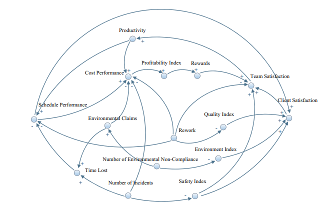

# Exam 2: Project performance (management & execution)

## Agile vs Traditional Paper.

Agile comes from software development, but is applicable to other types of projects. 

**Agile PM advantages:**
+ accelerating project/product delivery
+ enhancing ability to manage changing priorities.

**Agile PM challenges:**
+ work prioritization.
+ alignment among stakeholders on what to build next.
+ insufficient time for testing.
+ long feedback loops.
+ incompatibility of agile with the organizational processes and functions.

`Ciric, D., Lalic, B., Gracanin, D., Tasic, N.,Delic, M., & Medic, N. (2019). Agile vs. Traditional approach in project management: Strategies, challenges and reasons to introduce agile. Procedia Manufacturing, 39, 1407-1414.`

## Agile vs Structured software development paper
Study of the distributed project of both Agile and Structured development teams. The study shows no significant difference between the two types of processes.

## Does Agile Work ?
Study tested `efficiency` and `stakeholder satisfaction` shows positive impact of Agile.

Bell curve relationship, between planning and project success:
+ too little planning is bad
+ too much planning is also bad

Agile depends on continuous customer involvement
+ for establishing goals
+ to provide feedback to progressive prototypes

Customers believe that daily meetings kept them up to date and helped to "reduce the confusion about what should be developed" [^1]

Scrum Poker was found to have a positive impact, because it gives insight into the development process [^2]

:::theorem Extreme Programming (XP)
Agile methodology for software development based on scenario-based requirements, testing happening as early as possible and pair programming.
:::

In XP customer time is spent on:
1. planning poker sessions
2. acceptance testing
3. retrospective sessions

Study suggests Agile has a positive impact on efficiency, stakeholder satisfaction and perception of overall project performance.

`Serrador, P., and Pinto, J. (2015) Does Agile work? A quantitative analysis of agile project success. International Journal of Project Management, 33 (5): 1040-1051`

## Cost and time project mgmt success paper.

## System Dynamics Approach for Forecasting Performance of Construction Projects

Paper is focused on performance forecasting too assist in obtaining warnings about potential problems.

:::theorem System Dynamics
System Dynamics is a computer-based mathematical modeling approach for strategy development and better decision making in complex systems. This approach uses computer-aided simulation methodology based on feedback systems theory which complements the other Systems Thinking approaches.
:::

Performance forecasting is a complex and dynamic process that includes many indices that are interdependent. Therefore a System Dynamics model was created which can forecast the performance of (construction) projects based on the contractor's perspective.

Model was developed with the performance variables:
1. cost
2. schedule
3. quality
4. profitability
5. safety
6. environment
7. team satisfaction
8. client satisfaction

:::theorem Casual Loop Diagram
A causal loop diagram consists of four basic elements: the variables, the links between them, the signs on the links (which show how the variables are interconnected), and the sign of the loop (which shows what type of behavior the system will produce). By representing a problem or issue from a causal perspective, you can become more aware of the structural forces that produce puzzling behavior.
:::

> Project Management Casual Loop Diagram

`Leon H, Osman H, Georgy M, et al. (2018) System Dynamics Approach for Forecasting Performance of Construction Projects. Journal of Management in Engineering 34(1): 04017049. DOI: 10.1061/(ASCE)ME.1943-5479.0000575`

## Dashboards

:::theorem Dashboard
A data dashboard is any visual display of data used to monitor conditions and or facilitate understanding. **key indicators** need to be understood at a glance.
:::

An analytical process is only as good as how it is *communicated* and *deployed*.
+ who receives the reports ?
+ how are the workflows deployed to production ?
+ can data insights be turned into useful policies?

Today it is common for reports to be **automated**

### Dashboards
**Purpose**
+ communicate data
+ report data
#### Dashboard Foundation
+ who is the target audience?
  + role (what decisions do they make)
  + workflow (dashboard used on daily basis vs weekly)
  + data expertise level
+ what value does the dashboard add?
  + to help managers make decisions
  + to educate people
  + to set goals and expectations
  + to evaluate and communicate progress
+ what type of dashboard is being created?
  + scope: specific to broad
  + time horizon:
    + historical
    + real time
    + snapshot
    + predictive
  + level of detail
    + high level: only critical data
    + drill down: allow the user to gain more context by looking at more data.
  + point of view:
    + prescriptive: gives a solution to problem using data as proof.
    + exploratory: allows to explotre to find possible issues.

> The foundation of good dashboards comes down to deciding what information is most important to the given audience in the context of interest; they should have a core theme based on the essence of either a problem or data story, while removing extraneous information from the process.
#### Dashboard Structure
+ Form: format in which the dashboard is delivered
  + paper
  + slides
  + web or mobile app
+ Layout: physical look of the dashboard
  + distributions => bar chart, scatter plots
  + compositions => pie chart, bar chart, tree map
  + comparisons => bubble chart, bullet plots
  + trends => line chart, area plot
  + use of icons, colors and fonts can guide the viewer attention.
+ design principles: fundamental objectives to guide design
+ functionality: capabilities of the dashboard
  + filters is a good way to customize the scope of a dashboard.

#### Dashboard Design
Critical components:
+ grids: makes data clean and readable
+ white space: helps with clutter.
+ color: provides meaning
+ visuals.

`Pelletier, Maia, and Patrick Boily. 2019. “Dashboards and Data Visualization, with Examples.”`

## 

`De  Streele,  A.  (2019) Contribution  to  Growth:  European  Digital  Single Market. European Parliament.`

**References** 

[^1]: [C. Mann and F. Maurer, "A case study on the impact of scrum on overtime and customer satisfaction," Agile Development Conference (ADC'05), 2005, pp. 70-79, doi: 10.1109/ADC.2005.1.](https://doi-org.ezproxy2.utwente.nl/10.1109/ADC.2005.1)
[^2]: 